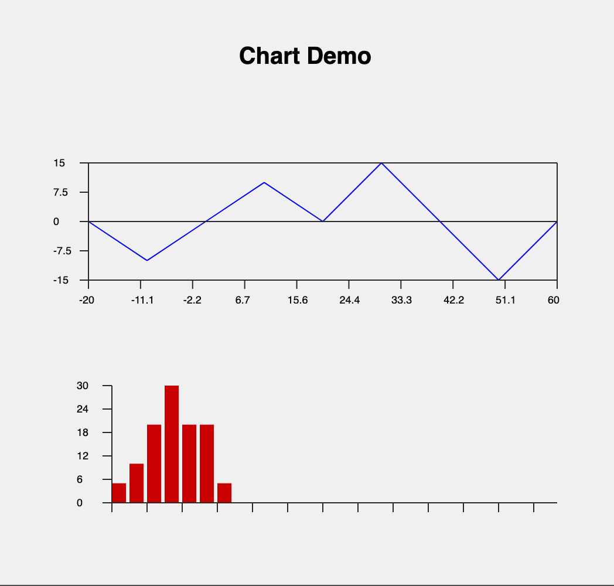
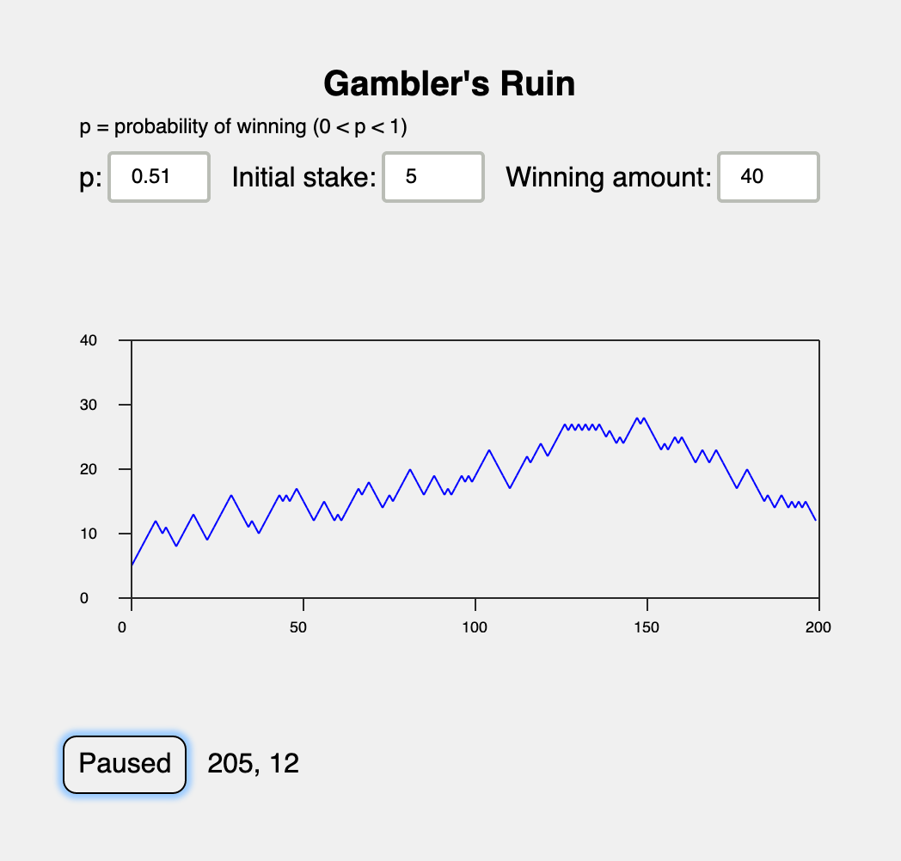

# Graph

Graph is a bare-bones package for rendering data as 
line and bar charts.  For a demo, see 
https://jxxcarlson.github.io/app/gamblers_ruin.html

The two examples below show how the package is used.  For mere
details, see the module documentation.

## 1. Line charts

Define the data.

    lineData  : List (Float, Float)
    lineData =
        [(-20, 0), (-10,-10), (0,0), (10, 10), (20,0), (30,15), (40,0), (50,-15), (60, 0)]

Set the chart parameters.

    lineGraphAttributes =
        {   graphHeight = 100
          , graphWidth = 400
          , options = [ Color "blue", XTickmarks 10, YTickmarks 5]
        }

Draw the chart.
        
    lineChart lineGraphAttributes lineData
     
## 2. Bar charts

Define the data.
        
    barData : List Float
    barData = [5, 10, 20, 30, 20, 20, 5]

Set the chart parameters. DeltaX controls the width of the bars.

    barGraphAttributes =
       {   graphHeight = 100
         , graphWidth = 400
         , options = [Color "rgb(200,0,0)", DeltaX 15, YTickmarks 6, XTickmarks 2]
       }
 
 Draw the chart. 
       
    barChart barGraphAttributes data2
    
 
    
## Demos

For a demo of the package, do

    $ git clone https://github.com/jxxcarlson/elm-graph.git
    $ cd elm-graph/examples/
    $ elm make Main.elm
    
Then open the resulting `index.html` file.  You might also
look at the gamblers's ruin demo, which uses a manually configured
data window:

    $ elm make GamblersRuin.elm
   

    

